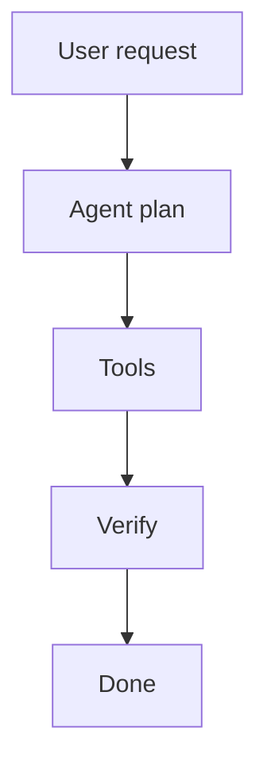

# Diagram — prefer mermaid over long prose

HFQ Code chat **renders fenced `mermaid` code blocks as diagrams**. When a picture is clearer than a paragraph, emit mermaid directly (no extra file tool required).

## When to draw

Default to a diagram when the user discusses:

- System architecture / module relations / deployment → `flowchart TD` or `graph TD`
- Request / call sequence → `sequenceDiagram`
- State machine / lifecycle → `stateDiagram-v2`
- DB / entity relationships → `erDiagram`
- Class / interface structure → `classDiagram`
- Decision branches → `flowchart TD` with diamonds
- Timeline / milestones → `gantt`

Pattern: **one-line conclusion → one compact diagram → short notes**.

## Keep diagrams compact (important)

1. **Vertical layout.** Prefer `flowchart TD`. Avoid wide `LR` layouts that shrink unreadable in chat.
2. **≤ ~10–12 main nodes** per diagram. Split into multiple small diagrams if needed.
3. **Main path only.** Drop rare edge cases into a short table or bullets.
4. **Readable labels.** Short node text; put detail outside the diagram.

## Output

Use the language the user uses for labels when possible.
